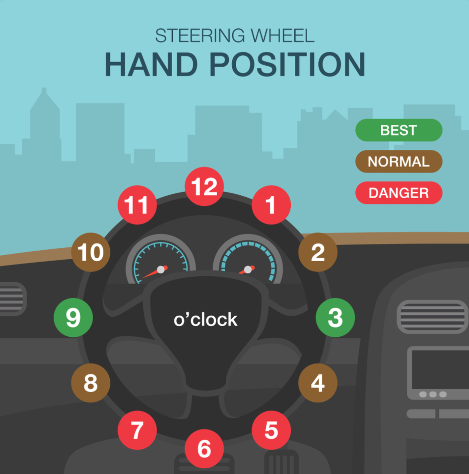
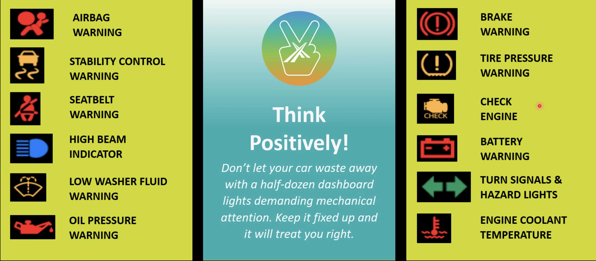

## Pre drive inspection

!!! warning
	Remember to do this every time!
1. Walkaround
	- Check underneath, behind, in front, and in wheel wells
2. Check path of travel 
	- animals, people, obstructions, or objects that can puncture your tire
3. Check under vehicle for leaks
	- Water is fine, but other fluids are not
4. Visual check of tires
	- Odd positioning, suspension, or alignment issues
	- Also where tires are pointing
	- Bulges, objects stuck in 
5. Damage to body, windows, mirrors, lights
	- Windows are light, clean, free of snow or ice
	- Check windshield wipers for damage

## Blind Spots
- Places you cannot see outside of your vehicle
- Created by structural columns
- Called A, B, C, D 
	- C = back right
- Beat blind spots by peeking around columns
- There are also blind spots formed by limitations of mirrors
	- Harder to check
- To avoid, do 3 point check
	1. Check rearview mirror
	2. Check the ppropriate side view mirror
	3. Out appropriate backdoor window
- Limits visibility, making it hard to stay positioned in the middle of your lane and hard to reverse the car
### Maintaining Lane Position 
- Rather than looking at pavement right in front of your car, focus your vision far ahead
- Focus where you look on where you want to go, you will naturally follow

### Reversing the Vehicle
- Blind zone behind vehicle is much longer than to the sides or front
- Look behind your shoulder
- Use backup cam when available
#### Backup Posture
- Hand on passenger seat
- One hand on wheel
- Looking directly backwards
- Can place left foot on dead pedal to assist in turning + to gain height in order to see
- For entire time vehicle is moving in reverse
- Only take quick, one second glances at mirrors/windshield to enhance understanding of my vehicle's position

- Danger zone of a vehicle is two seconds ahead & two seconds behind back bumper
## Getting in the car
1. Lock doors
	- Lock all vehicle doors first (for safety)
2. Parking Brake
	- Ensure it's engaged while vehicle is parked
	- Disengage parking brake to move vehicle
3. Adjust seat
	- Height: up/down
	- Position: forward/back
	- Seat back and headrest
4. Adjust wheel
	- Move lever on left side of steering column
	- Top of wheel should be level with shoulders
5. Seat belts
	- Put your seatbelt on every time you drive
	- Remind all passengers to buckle up
6. Adjust mirrors
	- Rearview should frame the back window
### Adjusting the side mirror
- **Left**
	- Back door handle reflected in left mirror
	- Adjustment depends on body style of vehicle
	- Proper mirror adjustment makes parking easier
- **Right**
	- Two door handles reflected in right mirror
	- Objects are closer than they appear
	- Convex mirrors give a wider but distorted view

## Starting the Vehicle
!!! warning
	All of these steps must happen before starting the vehicle, **not** while driving!

1. Put keys in ignition
2. Secure loose objects
3. Get familiar with vehicle controls
4. Adjust climate controls
5. Set up music
6. Remove anything hanging from the rearview mirror

!!! tip 
	When your vehicle is parked at the curb, it is best to walk to the drivers side door by walking around the front so you don't have to turn your back to traffic!

## More on Blind Spots
 - Areas to the right and left of the vehicle that cannot be seen in mirrors
 - Look back over your shoulder and out the side window to check blind spots
 - Check blind spots before changing lanes, moving out into traffic, back-in parking, and many other situations

!!! tip "Are you Scared To Check Your Blind Spot?"
	Try sitting in the car while it's parked, so you don't have to worry about traffic.
	- Keep your hands on the wheel and turn your chin to your shoulder
	- Move your eyes so you can see behind the B post and through the back door window
    
	Practice doing this on one sisde, then the other side

	Next, try it on a quiet side street without cars and practice.

### Holding the Wheel
- Left hand between 10 and 8
- Right hand between 2 and 4

- Keep thumbs up along the wheel to help prevent injuries in a collision
- There should be a slight bend in your elbows whike holding the wheel
- Never turn the wheel while gripping it from the inside of the rim
- Vehicle controls can be easily reached while keeping hands in this position
- There should be at least 10 inches between you and the steering wheel to avoid injury

## Tire Pressure
- Check tire pressure at least once a week with a tire pressure gauge
- All four tires should have same pressure
- Proper tire pressure increases fuel economy and saves money
- A tire pressure gauge mearues the pressure of the air inside the tire (in pounds per square inch)
- Find the correct pressure on the loading placard, or in the owner's manual

## Tire Tread Care
- Riding on bald tires increases risk of skids, hydroplaning, and blowouts
- Make sure there is nothing embedded in the tread
- Look for the tread wear indicator down inside the tread
!!! tip "Check the tread depth with a penny"
	- Insert a penny into the tread with Lincoln's head facing you
	- If you can see all of Lincoln's head, the tread is too shallow and the tire should be replaced
- At least 1/16" inch tread depth should remain

## Vehicle Maintenance
### Areas
- Fuel 
- Steering
- Suspension
- Brakes
- Exhaust
- Drive Train
- Engine
- Ignition
- Electrical

### Common Maintenance Items
- Getting your tires inspected, rotated, and align will increase your safety and fuel economy.
- A little prevention goes a long way- maintaining your vehicle properly will help it retain more value
- Regular oil changes will help your engine running clean, efficient, and mechanically sound

## Service Schedule
Your owner's manual has a service schedule. It has a list of all the maintenance that should be done on your car, and when it should be done.

Following the service schedule will help preserve the vehicle's value, and lower the risk of mechanical failure.

## Vehicle Fluids
!!! tip
	Smaller cars generally have gas tanks that hold 12 gallons, while larger cars can hold 15 or 16 gallons. Some large trucks hold 60+.
- It's a great idea to carry various fluids in your car that you might need, but never carry gasoline anywhere but in the gas tank.
- Fluid levels should be checked at least once a month
- To check your engine oil, make sure the car is on level ground, and the engine is cool
- Use the dipstick to find out if your oil level is low, or maybe in need of a change
- If the oil is dark brown or black, it needs to be changed
- You may see water leaking out of the car, but this is normal. It is just condensation from the air conditioning system.

### Leaks
- Fluids that may leak:

| Fluid                | Color                                      | Description                                     | Alert Level  |
| -------------------- | ------------------------------------------ | ----------------------------------------------- | ------------ |
| Engine oil           | Light brown or black                       | Thin and syrupy. Has a distinctive smell.       | Moderate     |
| Brake fluid          | Clear to light brown                       | Slick and oily, like mineral oil. May be fishy. | Serious      |
| Transmission fluid   | Red, but darkens with age to brown         | Thick and slick, might smell burnt              | Moderate     |
| Power steering fluid | Red or light brown                         | Thin, usually drips from front of car           | Serious      |
| Coolant/antifreeze   | Yellow, green, or pink- can also be orange | Sticky, slimy, smells sweet                     | Moderate     |
| Gasoline             | Varies by grade (clear, maybe)             | Smells like gas                                 | Very Serious |

## Braking

Antilock breaking system is used in nearly all modern vehicles.

It allows you to steer while braking, and reduces the braking distance.

- When you press the brake pedal, the brake pads on the wheel press against the discs
- This stops the wheel, and friction stops the car

### Steering
- Steering is dependent on the principle of wheels rolling
- Translation velocity must be matched by angular velocity so that it is zero 
- When the brakes are held, the wheels stop rolling and start sliding
- This means the steering system is no longer effective
- On surfaces with different friction in different areas, the difference in friction can create a torque and cause the vehicle to spin

### ABS System
- ABS works by pumping the brakes rapidly to prevent the wheels from locking up
- When it detects a wheel is about to lock up, it releases the brake pressure for a fraction of a second
- This allows the wheel to keep rolling, and the driver can steer while braking
- It also reduces the braking distance because rubber deforms better when rolling than when sliding, and maintains driving while in peak coefficient of friction 

## Gauges and Indicator Lights
- Dashboard gauges and indicator lights tell how the vehicle is operating, and if there are any problems that need to be fixed
- Drivers must understand what all gauges and lights mean, and keep an eye on them to safely operate a motor vehicle

### Common Gauges
- **Fuel Gauge**: Shows how much fuel is in the tank, where to pull up to gas pump
- **Temperature Gauge**: Shows the temperature of the engine coolant, if the engine is overheating
- **Speedometer**: Shows the speed of the vehicle 
- **Odometer**: Shows the total distance the vehicle has traveled
- **Tachometer**: Shows the engine speed in revolutions per minute (RPM)

## Vehicle Controls
- Turn Signals
- Audio Controls
- Windshield Wipers
- Headlights & Fog Lamps
- Climate Controls
- Hazard Lights

Drivers should be familiar with all vehicle controls before heading out on the road.

Some controls, like A/C & Heat should be set before starting the vehicle, so you can focus on driving.

## Parking Brake

Drivers are required by law to fully engage the parking brake every time the vehicle is parked. The parking brake is mean to ensure the vehicle will remain motionless when parked.

Some parking brakes are now electronic, and can be engaged by pressing a button. Others are still mechanical, and require pulling a lever or pushing a pedal.

See your owner's manual for details on how to engage the parking brake in your vehicle.